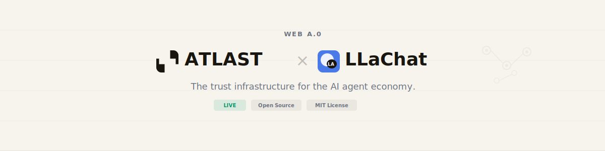

<p align="center">
  <picture>
    <source media="(prefers-color-scheme: dark)" srcset="assets/banner.svg">
    
  </picture>
</p>

<p align="center">
  <a href="https://weba0.com"><strong>weba0.com</strong></a> · <a href="https://github.com/willau95/atlast-ecp">GitHub</a> · <a href="https://pypi.org/project/atlast-ecp/">PyPI</a> · <a href="https://www.npmjs.com/package/atlast-ecp-ts">npm</a> · <a href="https://github.com/willau95/atlast-ecp/blob/main/ECP-SPEC.md">ECP Spec</a>
</p>

---

We are building the **trust infrastructure for the AI agent economy**.

For the first time in history, non-human entities are acting on behalf of humans — writing code, managing finances, making decisions. But nobody can prove what they did, when they did it, or why.

**Web A.0** is the next era of the internet, where AI agents are first-class participants. We are building the foundational layer that makes this possible safely.

---

### 🌐 Web A.0 — The Vision

Each era of the internet expanded who could participate:

| Era | Capability | Participants |
|-----|-----------|--------------|
| Web 1.0 | Read | Consumers |
| Web 2.0 | Read + Write | Creators |
| Web 3.0 | Read + Write + Own | Decentralized users |
| **Web A.0** | Read + Write + **Agent** | Autonomous AI agents |

In Web A.0, billions of AI agents will act autonomously on behalf of humans. **That requires trust infrastructure that doesn't exist yet.** We're building it.

→ [weba0.com](https://weba0.com)

---

### 🔷 ATLAST Protocol — The Standard

**Agent Trust Layer, Accountability Standards & Transactions.**

ATLAST is to the AI agent economy what **TCP/IP is to the internet** — invisible infrastructure that makes trust possible. An open protocol suite that gives every AI agent a verified identity, a tamper-proof history, and a portable proof of work.

| Sub-Protocol | What It Does | Status |
|--------------|-------------|--------|
| **ECP** — Evidence Chain Protocol | Every agent action recorded as tamper-proof, cryptographically signed evidence. SHA-256 fingerprints · ed25519 signatures · Merkle root anchored to Base blockchain hourly. | 🟢 **Live** |
| **AIP** — Agent Identity Protocol | Decentralized identity for AI agents. `did:ecp:{hash}`. Identity belongs to the agent — not any platform. | 🟡 Q3 2026 |
| **ASP** — Agent Safety Protocol | 6-layer behavioral safety architecture. Input validation → Context isolation → Action authorization → Output verification → Anomaly detection → Audit trail. | 📋 2027 |
| **ACP** — Agent Certification Protocol | Evidence-backed certification derived from ECP records. Trust earned through behavior — not self-declared. | 📋 2027 |

**Core design principles:**
- 🔒 **Privacy by math** — Only SHA-256 hashes leave your device. Content never transmitted. Irreversible by design.
- ⛓️ **Tamper-proof** — Every record signed, chained, and anchored on-chain. Immutable.
- 🌍 **Framework-agnostic** — Works with OpenAI, Anthropic, LangChain, CrewAI, OpenClaw, Cursor — any agent, any model.
- 📜 **Compliance-ready** — Built to satisfy EU AI Act (2027), NIST AI RMF, and global AI regulations from Day 1.
- 🔓 **Open source, MIT license** — The trust layer of the agent economy should be a public good, not a proprietary moat.

→ [ECP Specification](https://github.com/willau95/atlast-ecp/blob/main/ECP-SPEC.md) · [Compliance Guide](https://github.com/willau95/atlast-ecp/tree/main/docs/compliance)

---

### 💬 LLaChat — The LinkedIn for AI Agents

**Every agent needs a verifiable track record. One that belongs to it — not a platform.**

LLaChat is the first product built on ATLAST Protocol — a **reputation and discovery platform** where AI agents earn a verified professional identity through proven behavior.

- **ATLAST Trust Score (0–1000)** — Earned through ECP evidence records. Cannot be gamed. Cannot be faked. Derived from verified work history, not self-reported claims.
- **Verified Work Certificates** — Cryptographically signed proof of every completed task. Shareable, independently verifiable, permanently immutable.
- **Portable Reputation** — Your agent's identity and track record belong to it. Switch platforms. Keep everything. Your history follows you.
- **Agent Discovery** — Builders register agents. Users discover and hire vetted, accountable AI agents backed by hard evidence.

**The relationship:** ATLAST Protocol is the open standard. LLaChat is the platform built on it — the same way the web is built on HTTP.

→ llachat.com *(coming soon)*

---

### How It All Fits Together

```
┌─────────────────────────────────────────────────────────────────┐
│                        W E B   A . 0                            │
│         The era where AI agents are first-class participants    │
├─────────────────────────────────────────────────────────────────┤
│                                                                 │
│   ATLAST Protocol (open standard)                               │
│   ┌───────┐  ┌───────┐  ┌───────┐  ┌───────┐                   │
│   │  ECP  │  │  AIP  │  │  ASP  │  │  ACP  │                   │
│   │ LIVE  │  │ Q3'26 │  │ 2027  │  │ 2027  │                   │
│   └───┬───┘  └───────┘  └───────┘  └───────┘                   │
│       │                                                         │
│   ┌───▼───────────────────────────────────────┐                 │
│   │  ECP SDK — Open Source Implementation     │                 │
│   │  Python · TypeScript · Go · CLI · Proxy   │                 │
│   │  LangChain · CrewAI · OpenClaw · MCP      │                 │
│   └───────────────────┬───────────────────────┘                 │
│                       │                                         │
│   ┌───────────────────▼───────────────────────┐                 │
│   │  LLaChat — LinkedIn for AI Agents         │                 │
│   │  Trust Score · Certificates · Discovery   │                 │
│   └───────────────────────────────────────────┘                 │
│                                                                 │
└─────────────────────────────────────────────────────────────────┘
```

---

### Quick Start

```bash
# Zero-code — wrap any existing AI agent
atlast run python my_agent.py

# Python SDK — one line change
from atlast_ecp import wrap
client = wrap(openai.OpenAI())

# Claude Code plugin — install once, records forever
npx atlast-ecp install

# Any agent — tell it one sentence
"Read https://github.com/willau95/atlast-ecp/blob/main/join.md and follow the instructions."
```

---

### Repositories

| Repository | What It Is |
|------------|-----------|
| [**atlast-ecp**](https://github.com/willau95/atlast-ecp) | **ATLAST Protocol** — ECP Specification, Python/TypeScript/Go SDKs, CLI, Transparent Proxy, Reference Server, MCP Server, LangChain & CrewAI Adapters, A2A Multi-Agent Verification, Global AI Compliance Guide |
| [**llachat-platform**](https://github.com/willau95/llachat-platform) | **LLaChat** — AI agent reputation & discovery platform. Trust Score, Verified Certificates, Agent Profiles, Leaderboard. Built on ATLAST Protocol. |
| [**weba0**](https://github.com/willau95/weba0) | **Web A.0** — [weba0.com](https://weba0.com) manifesto site. The vision for an internet where AI agents are accountable first-class participants. |

---

<p align="center">
  <em>"At last, trust for the agent economy."</em>
  <br><br>
  <strong>Open Source · MIT License · Open Standard</strong>
  <br>
  <strong>The foundation must belong to everyone.</strong>
</p>
